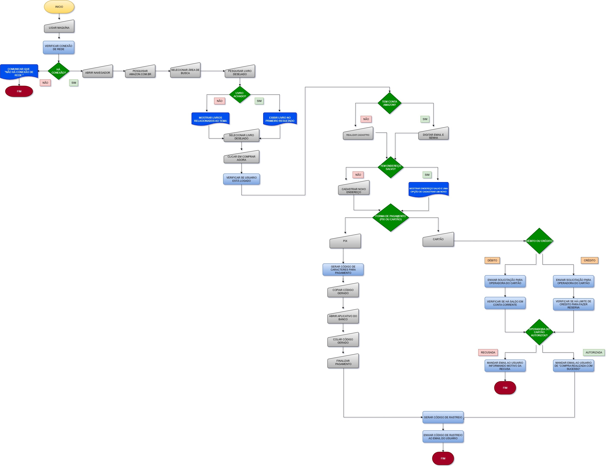

# Fluxograma_Projeto_Amazon

Projeto desenvolvido para a disciplina de Introdução a Programação do professor Messias Batista.

## Descrição
Este projeto apresenta um fluxograma que descreve todo o processo de compra de um livro no marketplace da Amazon, desde a inicialização do dispositivo (notebook/computador) até a finalização do pedido.
O desafio foi proposto pelo professor Messias Batista no curso de Sistemas para Internet da UNIESP.

## Visualização

>Professor: Messias Batista
>Curso: Sistemas para Internet - UNIESP
